# E-Commerce Microservices (Java + .NET + Angular)

A simple, didactic e-commerce platform showing a polyglot microservices setup:

- Java Spring Boot: Auth, Product, Order
- ASP.NET Core: Cart (Redis TTL), Payment (SQL Server)
- Spring Cloud Gateway + Eureka Discovery
- Angular + PrimeNG frontend with JWT interceptor

<p align="center">
  
  
  
  
  
  
</p>

## Table of Contents
- [Architecture](#architecture)
- [Data Models](#data-models)
- [Cart TTL Rules](#cart-ttl-rules)
- [Prerequisites](#prerequisites)
- [Ports](#ports)
- [Quickstart](#quickstart)
- [API Usage](#api-usage)
- [Configuration](#configuration)
- [Troubleshooting](#troubleshooting)

## Architecture

```mermaid
flowchart TD
    User["👤 User (Browser)"] --> UI["Angular + PrimeNG"]
    UI --> GW["API Gateway (Spring Cloud Gateway)"]
    subgraph Disc["Eureka Discovery"]
    end

    subgraph Java["Spring Boot Services"]
      Auth["Auth Service (PostgreSQL, JWT)"]
      Product["Product Service (MySQL)"]
      Order["Order Service (PostgreSQL)"]
    end

    subgraph DotNet["ASP.NET Core Services"]
      Cart["Cart Service (Redis, TTL logic)"]
      Payment["Payment Service (SQL Server)"]
    end

    GW --> Auth
    GW --> Product
    GW --> Order
    GW --> Cart
    GW --> Payment

    Auth <--> Disc
    Product <--> Disc
    Order <--> Disc
    Cart <--> Disc
    Payment <--> Disc
```



- API Gateway validates JWT (HS256) and injects `X-User-Id` into downstream requests.
- Services register with Eureka and are routed via the Gateway (Discovery Locator).

## Data Models

- Auth: `User(userId, username, email, passwordHash)`
- Product: `Product(productId, name, description, price, stock)`
- Order: `Order(orderId, userId, orderDate, status, totalAmount)` with `OrderItem(orderItemId, orderId, productId, quantity, price)`
- Cart (Redis Hash): `CartItem(cartItemId, userId, productId, quantity)`
- Payment: `Payment(paymentId, orderId, userId, status, paymentDate, amount)`

## Cart TTL Rules
- Default: items expire after 24 hours
- On Order placed: extend TTL to 7 days
- On Payment success: remove TTL (persist indefinitely)

## Prerequisites
- Java 17+, Maven
- .NET 8 SDK
- Node.js 18+ and npm
- Docker Desktop
- PowerShell (Windows) for helper scripts

## Ports
- discovery-server: 8761
- api-gateway: 8080
- auth-service: 9000
- product-service: 9001
- order-service: 9002
- cart-service: 5080 (default Kestrel)
- payment-service: 5081 (default Kestrel)
- frontend: 4200

## Quickstart

### 1) Start infrastructure (databases + Redis)
The compose file is under `infra/docker-compose.yml`.

```powershell
# From repo root
scripts\up-infra.ps1 -Detach

# To stop and remove volumes later:
scripts\down-infra.ps1
```

Services included:
- MySQL 8 (`productdb`)
- PostgreSQL 16 (`authdb` and `orderdb` via init SQL)
- Redis 7
- SQL Server 2022

### 2) Start Eureka Discovery
```powershell
mvn -q -f discovery-server/pom.xml spring-boot:run
```

### 3) Start API Gateway
```powershell
mvn -q -f api-gateway/pom.xml spring-boot:run
```

### 4) Start backend services (each in its own terminal)
```powershell
# Spring Boot
mvn -q -f auth-service/pom.xml spring-boot:run
mvn -q -f product-service/pom.xml spring-boot:run
mvn -q -f order-service/pom.xml spring-boot:run

# ASP.NET Core
dotnet run --project cart-service/CartService.csproj
dotnet run --project payment-service/PaymentService.csproj
```

### 5) Start frontend
```powershell
cd frontend
npm install
npm start
```
Open http://localhost:4200

## API Usage

All calls are via the Gateway and Discovery. The Angular interceptor adds `Authorization: Bearer <token>` and rewrites relative URLs to `/api/...`.

- Auth
  - POST `/auth-service/auth/register` body: `{ "username": "...", "email": "...", "password": "..." }`
  - POST `/auth-service/auth/login` body: `{ "username": "...", "password": "..." }`
  - Response: `{ "token": "..." }`
- Products
  - GET `/api/product-service/products`
- Cart (JWT required)
  - GET `/api/cart-service/cart`
  - POST `/api/cart-service/cart` body: `{ "cartItemId": "string", "productId": 1, "quantity": 1 }`
  - POST `/api/cart-service/cart/hold`
  - POST `/api/cart-service/cart/confirm`
- Orders (JWT required)
  - POST `/api/order-service/orders` body:
    ```json
    {
      "items": [
        { "productId": 1, "quantity": 2, "price": 10.0 }
      ],
      "totalAmount": 20.0
    }
    ```
- Payments (JWT required)
  - POST `/api/payment-service/payments` body:
    ```json
    { "orderId": 123, "amount": 20.0 }
    ```

## Configuration

Key config files (defaults ready for local dev):

- Auth: `auth-service/src/main/resources/application.yml`
  - `jdbc:postgresql://localhost:5432/authdb` (user `authuser` / `authpass`)
- Order: `order-service/src/main/resources/application.yml`
  - `jdbc:postgresql://localhost:5432/orderdb` (user `orderuser` / `orderpass`)
- Product: `product-service/src/main/resources/application.yml`
  - `jdbc:mysql://localhost:3306/productdb` (user `productuser` / `productpass`)
- Cart: `cart-service/appsettings.json` → `ConnectionStrings:Redis=localhost:6379`
- Payment: `payment-service/appsettings.json` → SQL Server `sa/Your_password123`
  - DB schema is auto-created at startup
- Gateway: `api-gateway/src/main/resources/application.yml`
  - `security.jwt.secret`, whitelist `/auth/`, discovery locator enabled

## Troubleshooting
- Docker not running → start Docker Desktop, then `scripts\up-infra.ps1`
- 401 at Gateway → verify JWT secret alignment (Auth vs Gateway), token present
- Port conflicts → change ports in service configs
- SQL Server readiness → Payment service creates schema; wait for container to become “healthy”
